# linux_monitor — architecture

> **Front-end consumers below are HISTORICAL.** Every `www/*.js` card and
> every `dashboards/*.yaml` board this document names was deleted — the card
> fleet and its 54 `/local/` resource registrations by GH-564, the 41 dead
> board files and the card-era tooling by GH-575. Verified live: the Lovelace
> resource registry holds no `/local/` entry and `lovelace/dashboards/list`
> returns `[]`.
>
> What that does and does not invalidate: **the entity, platform and
> resolution content is unaffected** and is still the reference for this
> integration. Only the consumer claims are stale, and they are stale in one
> direction — a card named here as a consumer no longer exists, so "who reads
> this entity" reads as *nobody in this repo* until a dashboard app claims it.
> Those apps live in their own repos (CLAUDE.md §5) and are not greppable from
> here, so absence of a consumer in this document is not evidence there is
> none. A "no consumer found" conclusion reached by grepping `www/` or
> `dashboards/` still holds; the directories it names simply no longer exist.

Siblings in this set: [`linux_monitor.md`](linux_monitor.md) — full
technical reference · [`linux_monitor_abstract.md`](linux_monitor_abstract.md) —
one-page plain-language summary · [`linux_monitor_process_flow.md`](linux_monitor_process_flow.md) —
control flow, execution order · [`linux_monitor_data_flow.md`](linux_monitor_data_flow.md) —
data lineage · [`linux_monitor_patent_disclosure.md`](linux_monitor_patent_disclosure.md) —
novelty assessment.

Static structure only — modules, files, entities, and the system
boundary. Nothing here moves; for what triggers when, see
`linux_monitor_process_flow.md`, and for what value goes where, see
`linux_monitor_data_flow.md`. Laid out spatially by system boundary, not
by execution order.

**The system boundary shrank in 0.3.0 (GH-470).** The monitored host
used to run a Glances daemon inside this diagram's outermost box — a
process that had to be installed, configured and kept alive. It is gone.
What remains outside Home Assistant is `sshd`, which every one of these
machines runs anyway, and the kernel's own `/proc` and `/sys`.

```mermaid
flowchart TB
    subgraph EXTERNAL["OUTSIDE HOME ASSISTANT — the monitored host itself"]
        direction TB
        SSHD["sshd — key-only, BatchMode.<br/>An unprivileged account with<br/>NO sudo grant: 'monitor' on the<br/>general-purpose hosts, 'kiosk'<br/>on the four kiosk Pis"]
        PROCFS["/proc, /sys, /etc/os-release —<br/>kernel-maintained, world-readable.<br/>NOTHING IS INSTALLED HERE and<br/>no daemon has to be running"]
        UTILS["findmnt, nproc, dpkg-query, apt —<br/>stock Debian, already present"]
    end

    subgraph HOSTMON["custom_components/linux_monitor — THIS INTEGRATION"]
        direction TB

        subgraph CFGMOD["config_flow.py"]
            CF["LinuxMonitorConfigFlow, VERSION 2 —<br/>one entry per host,<br/>unique_id = lowercased hostname"]
            OF["LinuxMonitorOptionsFlow —<br/>offline_expected only"]
        end

        subgraph CONSTMOD["const.py"]
            CONST["DOMAIN, timings, thresholds,<br/>CPU_HWMON_NAMES, CPU_SAMPLE_SECS —<br/>every magic number in one place,<br/>each with its argument beside it"]
        end

        subgraph COORDMOD["coordinator.py"]
            COORD["LinuxMonitorCoordinator<br/>(DataUpdateCoordinator) —<br/>one instance per config entry"]
            SHELL["FAST_CMD / SLOW_CMD —<br/>POSIX sh payloads, KEY=value out,<br/>__END__ terminated"]
            TRANSPORTFN["_ssh() / _ssh_raw()<br/>— the single transport"]
            PARSEFN["_parse_kv, _metrics, _cpu_percent,<br/>_mem_percent, _filesystems, _temp_c,<br/>_distro, _boot_time — module-level,<br/>NO HA imports, importable standalone"]
        end

        subgraph ENTMOD["entity.py"]
            EBASE["LinuxMonitorEntity —<br/>DeviceInfo + available rule,<br/>shared by both platforms below"]
        end

        subgraph SENSORMOD["sensor.py"]
            SENSORS["11x LinuxMonitorSensor, declared via<br/>the SENSORS tuple of<br/>LinuxMonitorSensorDescription —<br/>data-driven, not one class each"]
            RC["LinuxMonitorRebootCount —<br/>RestoreEntity, always available"]
        end

        subgraph BSENSORMOD["binary_sensor.py"]
            HEALTH["LinuxMonitorHealth —<br/>1 per config entry,<br/>always available=True"]
        end

        subgraph INITMOD["__init__.py"]
            SETUP["async_setup_entry /<br/>async_unload_entry /<br/>async_reload_entry"]
            MIGRATE["async_migrate_entry —<br/>v1 → v2, strips the<br/>vestigial glances_port key"]
        end

        CF --> COORD
        OF -.->|"triggers reload,<br/>not a direct call"| SETUP
        CONST --> COORD
        CONST --> HEALTH
        CONST --> CF
        CONST --> MIGRATE
        COORD --> SHELL
        COORD --> TRANSPORTFN
        COORD --> PARSEFN
        SETUP --> COORD
        EBASE --> SENSORS
        EBASE --> RC
        EBASE --> HEALTH
        COORD --> SENSORS
        COORD --> HEALTH
    end

    subgraph HACORE["HOME ASSISTANT CORE — the boundary"]
        direction TB
        DUC["DataUpdateCoordinator base class"]
        CE["ConfigEntry / config_entries registry<br/>(entry VERSION 2)"]
        DEVREG["Device registry —<br/>one device per host,<br/>identified by (DOMAIN, hostname.lower())"]
        ENTREG["Entity registry —<br/>entity_id assignment,<br/>platform tag 'linux_monitor'"]
        RESTORE["RestoreEntity store —<br/>reboot_count only"]
    end

    subgraph TESTS["TESTS — outside the component"]
        T["tools/test_linux_monitor_agentless.py —<br/>loads the REAL module bytes against<br/>stubbed homeassistant; fixtures are<br/>verbatim FAST_CMD output from one<br/>amd64 host and one Pi"]
    end

    subgraph CONSUMERS["CONSUMERS — outside this integration entirely"]
        direction TB
        MODEL["www/kiosk-fleet-model.js —<br/>SOURCES entry, kind: 'host',<br/>gated behind opts.includeHost"]
        CARD["www/linux-compute-card.js —<br/>the one caller passing<br/>includeHost: true, filtered<br/>to kind === 'host'"]
    end

    subgraph UNRELATED["A DIFFERENT SYSTEM — same physical host, no code shared"]
        direction TB
        NETPKG["packages/network_client_monitoring.yaml —<br/>tracks ecldev01 by UniFi-client-presence<br/>label 'infra_adjacent_device', NOT<br/>by any linux_monitor entity"]
    end

    TRANSPORTFN <-->|"ssh -i &lt;key&gt; ... BatchMode=yes<br/>— THE ONLY EDGE OUT"| SSHD
    SSHD --> PROCFS
    SSHD --> UTILS

    COORD -.->|"subclasses"| DUC
    SETUP -.->|"reads/writes"| CE
    MIGRATE -.->|"rewrites entry.data"| CE
    EBASE -.->|"registers into"| DEVREG
    SENSORS -.->|"registers into"| ENTREG
    HEALTH -.->|"registers into"| ENTREG
    RC -.->|"reads last state from"| RESTORE

    PARSEFN -.->|"imported and exercised<br/>with no HA running"| T
    HEALTH -.->|"imported and exercised"| T

    SENSORS -->|"state + attributes,<br/>read via hass.states"| MODEL
    HEALTH -->|"state + attributes,<br/>read via hass.states"| MODEL
    MODEL --> CARD

    NETPKG -.->|"no relationship —<br/>shown for contrast only,<br/>see linux_monitor.md §6"| HOSTMON

    style SSHD fill:#3a2a1a,stroke:#c98a2b,color:#eee
    style PROCFS fill:#3a2a1a,stroke:#c98a2b,color:#eee
    style UTILS fill:#3a2a1a,stroke:#c98a2b,color:#eee
    style NETPKG fill:#2a1a3a,stroke:#8a4ac9,color:#eee
    style DUC fill:#1a2a3a,stroke:#2b7ac9,color:#eee
    style CE fill:#1a2a3a,stroke:#2b7ac9,color:#eee
    style DEVREG fill:#1a2a3a,stroke:#2b7ac9,color:#eee
    style ENTREG fill:#1a2a3a,stroke:#2b7ac9,color:#eee
    style RESTORE fill:#1a2a3a,stroke:#2b7ac9,color:#eee
    style T fill:#1a3a1a,stroke:#2b9c4a,color:#eee
```

## Module inventory

Line counts read from the working tree at 0.3.0.

| File | Lines | Role |
|---|---|---|
| `const.py` | 151 | Every constant: domain, config keys, defaults, timings, thresholds, `CPU_HWMON_NAMES`, `CPU_SAMPLE_SECS`. Carries the component's own scoping rationale in its module docstring — the "no agent," "no remote patch," "no DHCP discovery," "no sudo" decisions are recorded here, not in a design doc elsewhere. Also holds `LEGACY_CONF_GLANCES_PORT`, which exists solely so the migration can strip it. |
| `coordinator.py` | 538 | `LinuxMonitorCoordinator`, the two shell payloads (`FAST_CMD`, `SLOW_CMD`), the single transport pair (`_ssh`/`_ssh_raw`), and nine module-level parse/typed-reader helpers with no HA imports. |
| `entity.py` | 66 | `LinuxMonitorEntity`, the shared base both platforms inherit — `DeviceInfo` construction and the shared `available` rule live exactly once here. |
| `sensor.py` | 254 | Eleven reading entities declared data-driven via a tuple of `LinuxMonitorSensorDescription` (a dataclass carrying `value_fn`/`attrs_fn` closures), plus `LinuxMonitorRebootCount`, the one `RestoreEntity`. |
| `binary_sensor.py` | 119 | One entity class, `LinuxMonitorHealth` — hard-overrides `available` to always `True`. |
| `config_flow.py` | 180 | `LinuxMonitorConfigFlow` (`VERSION = 2`, one step) plus `LinuxMonitorOptionsFlow`. Includes an **SSH** hostname probe (`_probe_hostname`) used only during setup, never during polling. |
| `__init__.py` | 66 | Platform list, entry setup/unload/reload, and `async_migrate_entry` (v1 → v2). `LinuxMonitorConfigEntry` is a typed alias other modules import for the `entry.runtime_data` shape. |
| `manifest.json` | 13 | `version: 0.3.0`, `integration_type: device`, `iot_class: local_polling`, zero HA dependencies, zero PyPI requirements. |
| `strings.json` / `translations/en.json` | 42 each | Config/options flow UI text — byte-identical to each other, asserted by direct comparison. |
| `tools/test_linux_monitor_agentless.py` | — | Outside the component. Loads the real module bytes against stubbed `homeassistant`; wired into `.github/workflows/tools-tests.yml`. |

## Structural relationships worth naming explicitly

- **The transport surface is now one function pair.** `_fetch_glances()`
  and the `aiohttp` client session it needed are gone, along with the
  `asyncio.gather()` that ran them in parallel with SSH. `aiohttp` is no
  longer imported anywhere in the component — asserted in the test, as a
  code form rather than as a grep for the word "glances," since every
  module here deliberately *documents* the removal in prose.
- **`coordinator.py`'s parse helpers import nothing from
  `homeassistant`.** This mirrors the design choice `household_state.md`
  documents for its own resolver modules — pure functions are testable
  without a running HA instance. That gap is now closed:
  `tools/test_linux_monitor_agentless.py` exercises them directly against
  real captured host output, and carries a self-test proving its own
  assertions can fail (LAW §4).
- **Two hardware classes, one code path.** The fleet spans x86-64
  (`ecldev01`) and aarch64 (`eclprod01` plus the four kiosk Pis), and
  they genuinely differ on two fields: which `hwmon` device carries the
  CPU temperature (`coretemp` vs. `cpu_thermal`) and which
  `/proc/cpuinfo` line carries the model string (`model name` vs. a
  capital-`Model` board name). Both differences are resolved by
  *discovery inside the shell payload* — matching hwmon by name, trying
  the capital-`Model` line first — never by an architecture test, so no
  code path exists that only one class of host executes.
- **`entity.py` is the only shared base**, imported by both `sensor.py`
  and `binary_sensor.py` — exactly one place `DeviceInfo` is
  constructed and exactly one place the `available` rule is defined,
  matching the "one accessor" discipline (LAW §1).
- **The device boundary is the hostname, lower-cased**
  (`(DOMAIN, c.hostname.lower())` in `entity.py`, the same value as the
  config flow's `unique_id`). Nothing keys off the config entry id or
  the IP address for identity — only the hostname string. This is what
  makes the 0.3.0 transport swap invisible to the registries: neither
  half of the unique_id was touched.
- **This integration shares its coordinator/dwell pattern with
  `custom_components/kiosk_pi`, but imports nothing from it.** Every
  file's docstring references `kiosk_pi` for rationale, but no
  `from custom_components.kiosk_pi import ...` exists — the two are
  structurally parallel, not code-sharing. A defect fixed in one does
  not propagate to the other without a person doing it by hand. Both
  have now independently dropped Glances (`kiosk_pi` 0.12.0 / GH-467,
  `linux_monitor` 0.3.0 / GH-470), which is an instance of exactly that
  cost.
- **The system-context edge into HA core is narrow**: one
  `DataUpdateCoordinator` subclass, one `ConfigEntry` per host, standard
  device/entity registry writes, and one `RestoreEntity` read. No custom
  services, no events, no `.storage` file of its own.
- **The edge to consumers is entirely through entity state** — HA's
  ordinary `hass.states` surface, read by `kiosk-fleet-model.js` exactly
  the way any Lovelace card reads any entity. There is no direct
  JS-to-Python channel and no WebSocket command specific to this
  integration.
