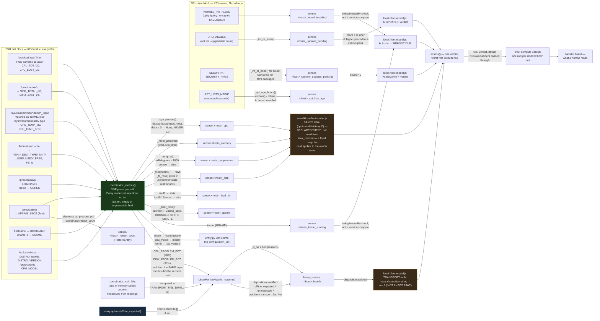

# linux_monitor — data flow

> **Front-end consumers below are HISTORICAL.** Every `www/*.js` card and
> every `dashboards/*.yaml` board this document names was deleted — the card
> fleet and its 54 `/local/` resource registrations by GH-564, the 41 dead
> board files and the card-era tooling by GH-575. Verified live: the Lovelace
> resource registry holds no `/local/` entry and `lovelace/dashboards/list`
> returns `[]`.
>
> What that does and does not invalidate: **the entity, platform and
> resolution content is unaffected** and is still the reference for this
> integration. Only the consumer claims are stale, and they are stale in one
> direction — a card named here as a consumer no longer exists, so "who reads
> this entity" reads as *nobody in this repo* until a dashboard app claims it.
> Those apps live in their own repos (CLAUDE.md §5) and are not greppable from
> here, so absence of a consumer in this document is not evidence there is
> none. A "no consumer found" conclusion reached by grepping `www/` or
> `dashboards/` still holds; the directories it names simply no longer exist.

Siblings in this set: [`linux_monitor.md`](linux_monitor.md) — full
technical reference · [`linux_monitor_abstract.md`](linux_monitor_abstract.md) —
one-page plain-language summary · [`linux_monitor_process_flow.md`](linux_monitor_process_flow.md) —
control flow, execution order · [`linux_monitor_architecture.md`](linux_monitor_architecture.md) —
static module structure and system boundary · [`linux_monitor_patent_disclosure.md`](linux_monitor_patent_disclosure.md) —
novelty assessment.

Data lineage only — what value originated where and what it became by
the time it reached an entity or a consumer. For what triggers when, see
`linux_monitor_process_flow.md`.

**Every origin below is a file on the monitored host** (or a stock
utility reading one). Since 0.3.0 (GH-470) there is no daemon in this
diagram: the Glances REST API that used to occupy the leftmost column
was replaced field-for-field by `/proc`, `/sys`, `findmnt`, `nproc` and
`/etc/os-release`, all read over the SSH connection the integration
already opened, by an account with no sudo.

## Notes on lineage that isn't obvious from the boxes

- **The percentages are computed here now, not received.** Glances
  handed over `cpu.total`, `mem.percent` and `fs[].percent` already
  reduced; `/proc` and `findmnt` hand over the raw counters. The
  formulas were deliberately matched to psutil's own — which is what
  Glances used — so the recorder series keep their meaning across the
  swap rather than stepping at the cutover:
  - CPU: total excludes `guest`/`guest_nice` (Linux already counts those
    inside `user`/`nice`, so they cancel out of both sums), busy
    excludes `idle` and `iowait`.
  - Memory: `(MemTotal − MemAvailable) / MemTotal` — **MemAvailable, not
    MemFree**. On a healthy Linux box with a warm page cache, MemFree
    reads like a permanent emergency.
  - Disk: `used / (used + free)`, **not** `used / size`. The gap is the
    root-reserved blocks; dividing by size instead under-reports every
    ext4 filesystem by about 5%. Asserted directly in
    `tools/test_linux_monitor_agentless.py`, including a check that the
    result differs from the naive formula.
- **Temperature is matched by hwmon `name`, never positionally.** An
  Intel box exposes `pch_cannonlake`, `hp`, `ucsi_source_psy_*` and
  `iwlwifi_1` as hwmon devices alongside `coretemp`, and `iwlwifi_1`'s
  `temp1_input` answers `ENODATA` while the radio is idle — so "the
  first hwmon with a temperature input" would read the wrong chip or
  fail outright. `CPU_HWMON_NAMES` in `const.py` is the preference list;
  the chosen source is published on the sensor's `source` attribute, so
  a reading can always be traced to the chip that produced it. Measured
  live: `coretemp` on `ecldev01`, `cpu_thermal` on all five Pis.
- **Filesystems cross the channel as indexed key groups, never a
  delimited join.** A mount point can contain any byte but NUL and
  newline, so no join character is safe (LAW.md §4). `findmnt -r`
  escapes whitespace as `\x20`, which `_unescape()` reverses on the
  Python side. `--real` also drops the bind mounts that made Glances
  report `/` four times on `ecldev01` while never mentioning `/boot` —
  so the health sensor's per-mount threshold loop now covers strictly
  more real filesystems than it did.
- **Every threshold a consumer applies is declared in the consumer, not
  read from `linux_monitor`.** `linux_monitor` applies two
  (`CPU_PROBLEM_PCT`, `DISK_PROBLEM_PCT`, both 90%, both in `const.py`)
  to produce the health binary_sensor's own `is_on`.
  `kiosk-fleet-model.js`'s `BANDS` table is a **second, independent**
  set the card applies to the same raw percentage — the two never share
  a constant, so the health sensor and the card's row verdict can
  legitimately disagree about whether a given CPU percentage is a
  problem.
- **`kernel_running` vs. `kernel_installed` is a plain string
  inequality** in the consumer (`kr !== ki`), not a version-aware
  compare. The `-unsigned` exclusion that makes `kernel_installed`
  trustworthy happens once, upstream, inside the SSH `SLOW_CMD` shell
  script — by the time the value reaches the consumer it is already a
  clean version string with no version-sort logic left to apply.
- **The uptime timestamp is derived, and the derivation got simpler.**
  Glances reported uptime as an elapsed-time *string* (`"18:00:08"`,
  `"1 day, 2:03:04"`) that had to be regex-parsed back into a
  `timedelta`, with a silent `None` on any unexpected format.
  `/proc/uptime` is seconds-since-boot as a float, so that regex and its
  whole class of parse failure are gone. The result is still **rounded
  to the minute** before publication: `/proc/uptime` has sub-second
  precision, so an unrounded boot instant would differ by a few
  milliseconds on every poll and rewrite a `TIMESTAMP` entity's state
  once a minute forever.
- **The reboot counter is the one reading derived across polls.**
  Everything else in the published dict is a pure function of the most
  recent read; `reboot_count` increments when `UPTIME_SECS` decreases
  relative to the previous poll, which is what makes it survive a
  crash-loop that self-heals inside the health sensor's dwell (GH-402).
  It is also the one value restored across an HA restart, via
  `RestoreEntity` — so an HA bounce mid-diagnosis does not read as the
  crash-loop having stopped.
- **The health binary_sensor's `reasons` list is recomputed from the
  published dict on every property access**, not carried forward from
  whatever produced the fail-streak counter — `_ssh_fails` is the only
  state that persists in-memory across polls besides `reboot_count` and
  the cached slow block; everything else in `_reasons()` is a pure
  function of the coordinator's most recently published dict.
