# linux_monitor — process flow

> **Front-end consumers below are HISTORICAL.** Every `www/*.js` card and
> every `dashboards/*.yaml` board this document names was deleted — the card
> fleet and its 54 `/local/` resource registrations by GH-564, the 41 dead
> board files and the card-era tooling by GH-575. Verified live: the Lovelace
> resource registry holds no `/local/` entry and `lovelace/dashboards/list`
> returns `[]`.
>
> What that does and does not invalidate: **the entity, platform and
> resolution content is unaffected** and is still the reference for this
> integration. Only the consumer claims are stale, and they are stale in one
> direction — a card named here as a consumer no longer exists, so "who reads
> this entity" reads as *nobody in this repo* until a dashboard app claims it.
> Those apps live in their own repos (CLAUDE.md §5) and are not greppable from
> here, so absence of a consumer in this document is not evidence there is
> none. A "no consumer found" conclusion reached by grepping `www/` or
> `dashboards/` still holds; the directories it names simply no longer exist.

Siblings in this set: [`linux_monitor.md`](linux_monitor.md) — full
technical reference · [`linux_monitor_abstract.md`](linux_monitor_abstract.md) —
one-page plain-language summary · [`linux_monitor_data_flow.md`](linux_monitor_data_flow.md) —
data lineage · [`linux_monitor_architecture.md`](linux_monitor_architecture.md) —
static module structure and system boundary · [`linux_monitor_patent_disclosure.md`](linux_monitor_patent_disclosure.md) —
novelty assessment.

Control flow only — what triggers, what runs next, what branches. For
what value came from where, see `linux_monitor_data_flow.md`.

**One transport since 0.3.0 (GH-470).** The Glances REST daemon is gone,
and with it the `asyncio.gather()` across two transports, the per-plugin
serial fetch loop, and the separate `glances_fails` streak. What used to
be a fan-out is now a single subprocess call.

```mermaid
flowchart TD
    TICK["Every 60s<br/>(UPDATE_INTERVAL)<br/>DataUpdateCoordinator"] --> OFFLINE{"offline_expected<br/>option set?"}

    OFFLINE -->|"yes"| SHORT["Reset fail-streak to 0.<br/>Return static dict —<br/>no network I/O attempted"]
    SHORT --> ENTITIES

    OFFLINE -->|"no"| SSTART

    subgraph TRANSPORT["SSH fast transport — the only one"]
        direction TB
        SSTART["_ssh(FAST_CMD, 15s)"] --> SRAW["spawn ssh subprocess"]
        SRAW -->|"OSError on spawn"| SNONE1["return None"]
        SRAW -->|"spawned"| SWAIT{"communicate()<br/>within timeout?"}
        SWAIT -->|"timeout"| SKILL["kill process,<br/>log warning → return None"]
        SWAIT -->|"rc != 0"| SNONE2["return None"]
        SWAIT -->|"rc == 0"| SPARSE{"__END__ marker<br/>present in output?"}
        SPARSE -->|"no"| SNONE3["return None —<br/>a truncated read must not<br/>read as an empty one"]
        SPARSE -->|"yes"| SOK["parse KEY=value pairs"]
    end

    SNONE1 & SNONE2 & SKILL & SNONE3 & SOK --> TRACK

    TRACK["_track('ssh'):<br/>ok → reset streak to 0,<br/>log recovery if was ≥ dwell;<br/>fail → increment streak,<br/>log ONCE at the dwell crossing"] --> METRICS

    METRICS["_metrics(): KEY=value text<br/>→ typed readings.<br/>EVERY reader lands on None<br/>when its field is absent,<br/>empty or unparseable"] --> CPUGUARD

    CPUGUARD{"CPU: two /proc/stat<br/>samples, delta > 0?"}
    CPUGUARD -->|"no — identical or<br/>went backwards"| CPUNONE["cpu_percent = None,<br/>NEVER 0.0"]
    CPUGUARD -->|"yes"| CPUOK["cpu_percent = busy/total"]

    CPUNONE & CPUOK --> REBOOT

    REBOOT{"uptime_secs decreased<br/>since last poll?"} -->|"yes"| RINC["reboot_count += 1,<br/>log warning.<br/>Catches a crash-loop that<br/>self-heals inside the dwell"]
    REBOOT -->|"no"| SLOWCHECK
    RINC --> SLOWCHECK

    SLOWCHECK{"fast SSH ok this poll,<br/>AND (never run OR due:<br/>6h normal / 15min after<br/>a failed slow read)?"}
    SLOWCHECK -->|"no"| ENTITIES
    SLOWCHECK -->|"yes"| SLOWRUN["_ssh(SLOW_CMD, 60s) —<br/>same spawn/timeout/parse<br/>shape as the fast block"]

    SLOWRUN -->|"succeeded"| SLOWOK["cache result + timestamp.<br/>log recovery if previously failed"]
    SLOWRUN -->|"failed"| SLOWFAIL["clear cache to {}.<br/>log warning once at failure<br/>(not every retry)"]

    SLOWOK --> ENTITIES
    SLOWFAIL --> ENTITIES

    ENTITIES["Coordinator publishes one dict.<br/>NEVER raises UpdateFailed —<br/>every branch above returns<br/>a value, not an exception"]

    ENTITIES --> READINGS["sensor.py: 11 reading entities<br/>read value_fn(data) —<br/>go unavailable if their own<br/>source is missing (entity.py)"]
    ENTITIES --> RC["sensor.py: Reboot count —<br/>available ALWAYS True,<br/>RestoreEntity across HA restart"]
    ENTITIES --> HEALTH["binary_sensor.py: Health entity —<br/>available ALWAYS True.<br/>_reasons() re-derives disposition<br/>from the same published dict"]

    HEALTH --> HOFF{"offline_expected?"}
    HOFF -->|"yes"| HCLEAN["is_on = False,<br/>disposition 'offline_expected'.<br/>Scores CLEAN, never red"]
    HOFF -->|"no"| HONLINE{"online?"}

    HONLINE -->|"no"| HDWELL{"ssh fail-streak<br/>≥ TRANSPORT_FAIL_DWELL (3)?"}
    HDWELL -->|"yes"| HPROBLEM["is_on = True<br/>reason 'unreachable:N_polls'"]
    HDWELL -->|"no"| HFLAP["is_on = False,<br/>disposition 'transport_flap'"]

    HONLINE -->|"yes"| HTHRESH{"any filesystem > 90%<br/>or cpu > 90%?"}
    HTHRESH -->|"yes"| HIMMEDIATE["is_on = True, NO DWELL —<br/>host answered and the<br/>answer was bad"]
    HTHRESH -->|"no"| HCLEAR["is_on = False,<br/>disposition 'ok'"]

    READINGS & RC --> CONSUME["www/kiosk-fleet-model.js<br/>discoverHosts() + assess()"]
    HCLEAN & HPROBLEM & HFLAP & HIMMEDIATE & HCLEAR --> CONSUME

    CONSUME -.->|"gated: opts.includeHost<br/>default FALSE"| GATE["monitor-kiosk-pi-card /<br/>kiosk-pi-card —<br/>NOT WIRED (gate not opted in)"]
    CONSUME -->|"opts.includeHost: true"| CARD["linux-compute-card.js —<br/>the one caller that opts in,<br/>filtered to kind === 'host'"]

    style OFFLINE fill:#1a2a3a,stroke:#2b7ac9,color:#eee
    style SLOWCHECK fill:#1a2a3a,stroke:#2b7ac9,color:#eee
    style HDWELL fill:#1a2a3a,stroke:#2b7ac9,color:#eee
    style CPUGUARD fill:#1a2a3a,stroke:#2b7ac9,color:#eee
    style GATE fill:#3a2a1a,stroke:#c98a2b,color:#eee
    style CPUNONE fill:#3a1a1a,stroke:#c94a2b,color:#eee
    style ENTITIES fill:#1a3a1a,stroke:#2b9c4a,color:#eee
```

## What the CPU sample costs, and where it sits

`FAST_CMD` takes its first `/proc/stat` sample as its **first**
statement and its second as its **last**, with every other read riding
inside that window plus an explicit one-second `sleep`
(`CPU_SAMPLE_SECS`). The percentage is a ratio of deltas, so the exact
interval cancels out — only its being non-trivial matters.

This puts a floor of roughly one second on every poll, inside a 60-second
budget and well inside the 15-second `SSH_FAST_TIMEOUT`, on a connection
that was already being paid for. `const.py` argues why that cost is
preferable to the free alternative of delta-ing across polls: the
carried-delta form has no previous sample after any HA restart or entry
reload and must report `None` for a full minute, and a `None` that has to
be *remembered* in order to be produced is one `or 0` away from a
restart reading 0% CPU.

## Notes on branches not obvious from the diagram shape

- **There is no fan-out any more.** Before 0.3.0 this diagram had two
  parallel transport subgraphs joined by `asyncio.gather()`, and the
  health sensor combined their streaks with `min(glances_fails,
  ssh_fails)` — meaning *both* had to be down before a host was called
  unreachable. With one transport there is nothing to combine, so that
  floor, the second streak counter, and the `glances_ok` /
  `glances_missed_polls` attributes were removed rather than left
  publishing a constant.
- **`online` and `ssh_ok` are now the same fact.** Both keys are still
  published because they answer different questions to a reader ("is
  this host answering" vs. "did this transport answer"), but no branch
  can distinguish them. A consequence: there is no longer an
  `ssh_unreachable` rung underneath an online host, because a host that
  is online answered SSH and its streak is therefore zero. That rung was
  deleted rather than left as unreachable code.
- **The slow SSH block only ever runs after a poll where the fast block
  itself succeeded.** `SLOWCHECK`'s `fast is not None` condition means a
  currently-unreachable host cannot trigger a slow-block attempt that
  poll — the slow read waits for the fast one to prove the host answers
  at all first.
- **`offline_expected` short-circuits before the transport is attempted
  at all** — this is not a post-hoc filter on the results, it is a branch
  at the very top of `_async_update_data()` that skips the network I/O
  entirely, and it scores clean rather than red.
- **The reboot counter is deliberately outside the dwell logic.** A
  crash-loop that self-heals inside `TRANSPORT_FAIL_DWELL` never trips
  the health sensor, because the streak resets on the next good poll —
  measured on `ecldev01`, GH-402: roughly twenty hard reboots in 24
  hours tripped it once. Comparing `/proc/uptime` against the previous
  poll catches those, on the poll *after* recovery.
- **The health binary_sensor recomputes its own verdict from the
  published dict on every access** (`_reasons()` is called from the
  `is_on` property, not cached) — it does not receive a separate signal
  from the coordinator; it reads the same dict every reading entity
  reads.
